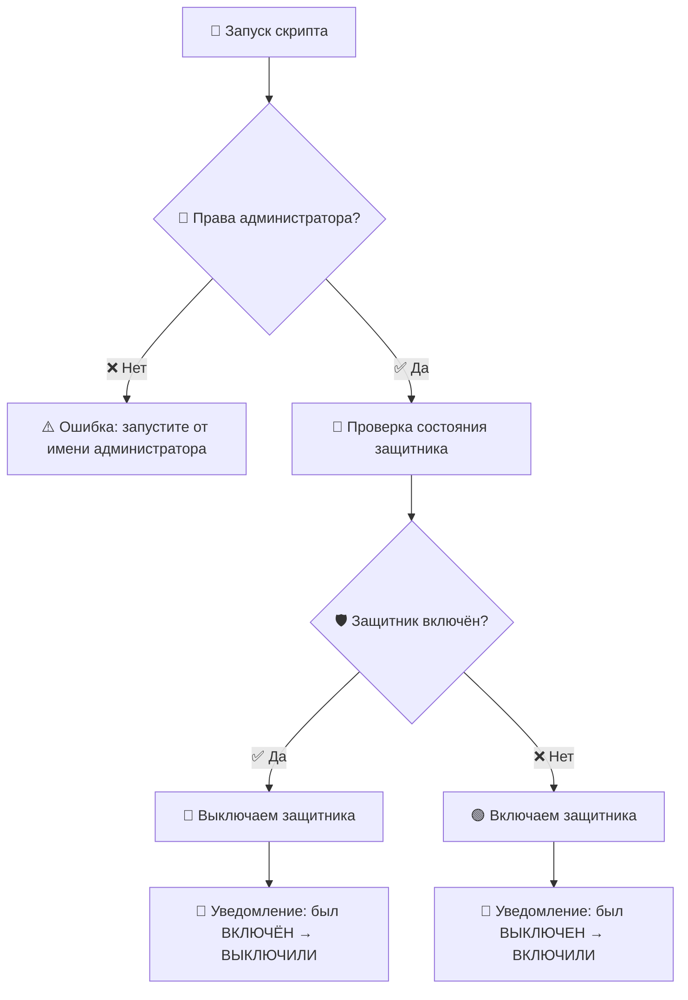

<p align="center">
  
</p>

<h1 align="center">🛡️ Toggle Defender</h1>

<p align="center">
  <b>Переключатель защиты в реальном времени Windows Defender одним кликом</b>
</p>

<p align="center">
  <a href="#"></a>
  <a href="#"></a>
  <a href="LICENSE"></a>
</p>

---

## 📋 Описание

**Toggle Defender** — простой и удобный скрипт, который позволяет **быстро переключать** защиту в реальном времени Windows Defender.

Скрипт автоматически определяет текущее состояние защитника:
- 🟢 Если **включён** — выключает
- 🔴 Если **выключен** — включает

При этом в консоли выводится понятное **уведомление** о том, каким было состояние и что было сделано.

---

## ✨ Возможности

| Функция | Описание |
|---------|----------|
| 🔄 **Авто-определение** | Автоматически проверяет текущий статус защитника |
| 🛡️ **Переключение** | Включает или выключает защиту одним кликом |
| 🔐 **Проверка прав** | Предупредит, если запущен без прав администратора |
| 💬 **Уведомления** | Подробный вывод в консоль о выполненных действиях |
| 🖥️ **Без зависимостей** | Работает на чистой Windows 10/11, ничего устанавливать не нужно |

---

## 🚀 Быстрый старт

### Способ 1 — Скачать и запустить

1. Скачайте файл [`Toggle_Defender.bat`](Toggle_Defender.bat)
2. **Правый клик** → **Запуск от имени администратора**
3. Готово! ✅

### Способ 2 — Клонировать репозиторий

```bash
git clone https://github.com/nickan/Toggle_Defender.git
cd Toggle_Defender
```

Затем запустите `Toggle_Defender.bat` от имени администратора.

---

## 📸 Пример работы

```
══════════════════════════════════════════════════
       Переключатель защитника Windows
══════════════════════════════════════════════════

Проверяем текущее состояние защитника...

[i] Защитник Windows сейчас: ВКЛЮЧЕН

    Выключаем защитник Windows...

══════════════════════════════════════════════════
  [OK] Защитник Windows был ВКЛЮЧЕН.
  [OK] Сейчас мы его ВЫКЛЮЧИЛИ.
══════════════════════════════════════════════════
```

---

## ⚙️ Как это работает



Скрипт использует PowerShell-командлет `Get-MpPreference` для проверки состояния и `Set-MpPreference` для переключения параметра `DisableRealtimeMonitoring`.

---

## ⚠️ Важно

> [!WARNING]
> Скрипт **обязательно** нужно запускать **от имени администратора**. Без прав администратора изменение настроек Windows Defender невозможно.

> [!CAUTION]
> Отключение защиты в реальном времени делает вашу систему **уязвимой** для вредоносного ПО. Отключайте защитник только при необходимости и **не забывайте включать его обратно**.

---

## 📄 Системные требования

- **ОС:** Windows 10 / Windows 11
- **PowerShell:** 5.1+ (встроен в Windows)
- **Права:** Администратор

---

## 📜 Лицензия

Этот проект распространяется под лицензией [MIT](LICENSE). Вы можете свободно использовать, изменять и распространять его.

---

<p align="center">
  Сделано с ❤️ для удобного управления Windows Defender
</p>
